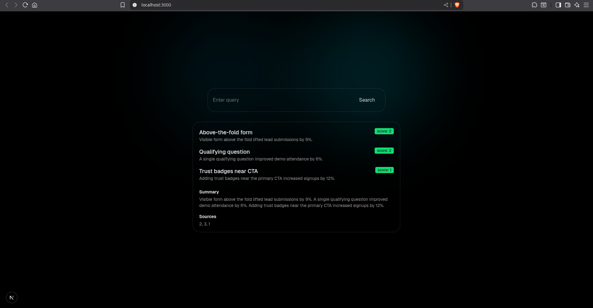

## Task A: Mini Full-Stack Search

- a compact search user interface that interacts with a backend route to
  retrieve and display the top matches from a local JSON dataset.

Clone project

```bash
git clone https://github.com/4joejoe/mini-fullstack-search.git
cd mini-fullstack-search/
```

Run Project

frontend

```bash
cd frontend
npm i && npn run dev
```

backend

```bash
cd backend
npm i && npm run dev
```



## Project implementaion details

> Backend

Minimal Project dependecies

- Express: For building rest API
- tsx: For running project in dev enviroment

Project has one route `/api/search` which is attached to `search.controller.ts` this contains business logic

Functions have typesafe implemetation

// sample search request to backend api

```bash
curl --location 'http://localhost:8000/api/search' \
--header 'Content-Type: application/json' \
--data '{
    "query":"user search query here"
}'
```

> Frontend

Next.js Project

Frontend has one page with search input form, controlled by `searchAction` server action

i've used server action to send queries to backend since it is safe and has simple implemtation

Search UI componenet has

- Search Pending State
- Loading indicator
- Clear Result and Error boundry defined
- Search query is sanatized using basic regex function only alphanumeric and punctuation is allowed
